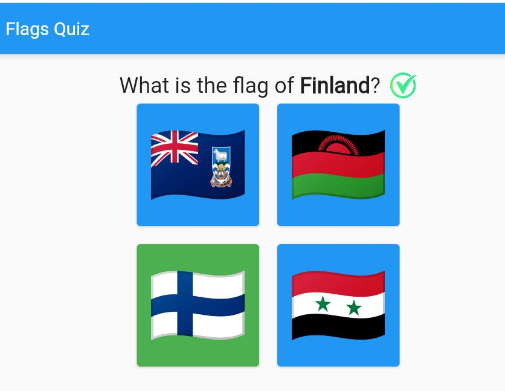
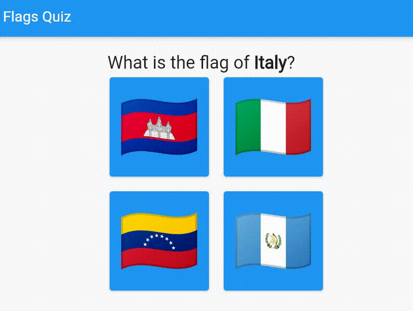

# Flags Quiz

Introduction to Flutter with a flags quiz game

## Start

Start the project from the **step-0** by downloading [this file](step0.zip) and enabling the web device for the project

## Steps

You can follow the project step by step using the commits

### [Step 1: Display list of flags](https://github.com/Draxent/flagsQuiz/commits/229d122b6f17757d62180509df51dba1ae7b225f)

### [Step 2: Add question](https://github.com/Draxent/flagsQuiz/commits/66689b6fc82126416399e72823f67a417633add8)

### [Step 3: Display the 4 hardcoded options](https://github.com/Draxent/flagsQuiz/commits/fa26af974677623fefdb04da2b7931f398950ed1)

### [Step 4: Generate random question and options](https://github.com/Draxent/flagsQuiz/commits/fd6b1dff026a625610efdddcbf4633e473a36cd3)

### [Step 5: Show answer with button background and icon](https://github.com/Draxent/flagsQuiz/commits/339e89636333d2c4177cea590dbdb5bb674ae9f7)

### [Step 6: Wait and generate new question](https://github.com/Draxent/flagsQuiz/commits/f601b83c46e2fba445e803a64c6096b7fef3f8fa)

## Links

- [Write your first Flutter app](https://docs.flutter.dev/get-started/codelab)
- [Flutter Widget of the Week](https://www.youtube.com/watch?v=JSqUZFkRLr8&list=PLjxrf2q8roU23XGwz3Km7sQZFTdB996iG&ab_channel=Flutter)
