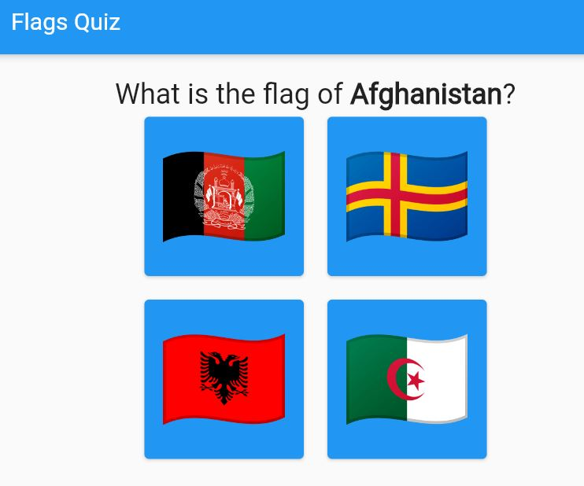
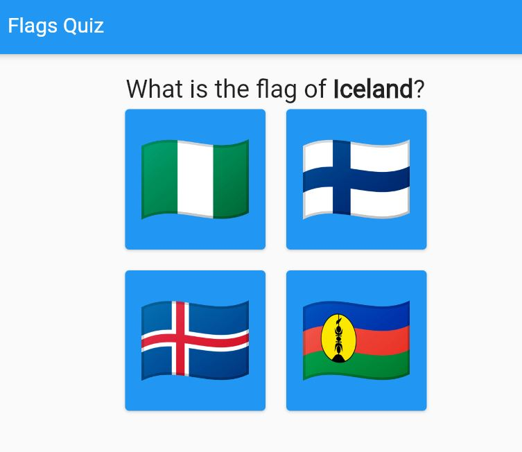

# Flags Quiz

Introduction to Flutter with a flags quiz game

## Steps

### Step 1: Display list of flags

### Step 2: Add question

### Step 3: Display the 4 hardcoded options

### Step 4: Generate random question and options

## Links

- [Write your first Flutter app](https://docs.flutter.dev/get-started/codelab)
- [Flutter Widget of the Week](https://www.youtube.com/watch?v=JSqUZFkRLr8&list=PLjxrf2q8roU23XGwz3Km7sQZFTdB996iG&ab_channel=Flutter)
